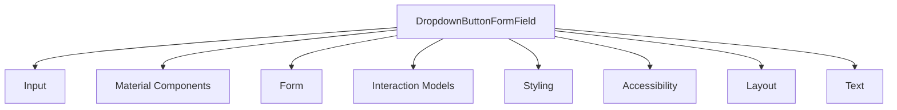

## Introdução

No desenvolvimento de aplicativos Flutter, a criação de interfaces de usuário interativas e intuitivas é essencial para proporcionar uma experiência positiva ao usuário. Um dos componentes fundamentais para a coleta de dados do usuário é o **DropdownButtonFormField**. Este widget combina a funcionalidade de um campo de formulário com um menu suspenso, permitindo que os usuários selecionem uma opção de uma lista pré-definida de valores.

Este guia detalhado abordará todos os aspectos do **DropdownButtonFormField**, incluindo sua definição, funcionamento, sintaxe, restrições, casos de uso, propriedades, métodos e categorias de widgets relacionados. Além disso, serão fornecidos exemplos de código práticos para ilustrar sua aplicação no desenvolvimento de aplicativos Flutter.

## Sumário

1. [O que é e para que serve?](#o-que-é-e-para-que-serve)
2. [Como funciona?](#como-funciona)
3. [Sintaxe de uso](#sintaxe-de-uso)
4. [Restrições de uso](#restrições-de-uso)
5. [Quando utilizar?](#quando-utilizar)
6. [Propriedades do DropdownButtonFormField](#propriedades-do-dropdownbuttonformfield)
7. [Principais Métodos do DropdownButtonFormField](#principais-métodos-do-dropdownbuttonformfield)
8. [Categorias de Widgets que mais se encaixam](#categorias-de-widgets-que-mais-se-encaixam)
9. [Exemplos Práticos](#exemplos-práticos)
    - [Exemplo Básico de DropdownButtonFormField](#exemplo-básico-de-dropdownbuttonformfield)
    - [Exemplo com Validação](#exemplo-com-validação)
    - [Exemplo com Tema Personalizado](#exemplo-com-tema-personalizado)
10. [Melhores Práticas](#melhores-práticas)
11. [Considerações Finais](#considerações-finais)

## O que é e para que serve?

**DropdownButtonFormField** é um widget no Flutter que combina a funcionalidade de um menu suspenso (**DropdownButton**) com as capacidades de um campo de formulário (**FormField**). Ele permite que os desenvolvedores criem campos de seleção onde os usuários podem escolher uma única opção de uma lista de valores predefinidos.

### Principais Funcionalidades:

- **Seleção de Opções**: Permite que o usuário selecione uma opção dentre várias disponíveis.
- **Integração com Formulários**: Facilita a validação e o gerenciamento do estado em formulários.
- **Personalização**: Oferece diversas propriedades para personalizar sua aparência e comportamento.

### Casos de Uso Comuns:

- Seleção de país em um formulário de cadastro.
- Escolha de categoria em um filtro de pesquisa.
- Seleção de data ou hora em campos de agendamento.

## Como funciona?

O **DropdownButtonFormField** atua como um campo de formulário que exibe um menu suspenso quando interagido. Ele utiliza um conjunto de **DropdownMenuItem** para listar as opções disponíveis. Quando o usuário seleciona uma opção, o valor selecionado é armazenado e pode ser utilizado para validação ou processamento posterior.

### Funcionamento Interno:

1. **Renderização**: O widget renderiza um campo que, ao ser tocado, exibe uma lista de opções em um menu suspenso.
2. **Interação**: O usuário interage com o campo, selecionando uma das opções disponíveis.
3. **Atualização de Estado**: O valor selecionado é atualizado no estado do formulário, permitindo que seja validado ou utilizado conforme necessário.
4. **Validação**: Se integrado a um formulário, o campo pode validar a seleção, garantindo que uma opção válida seja escolhida.

## Sintaxe de uso

A utilização do **DropdownButtonFormField** envolve a definição de várias propriedades essenciais para determinar seu comportamento e aparência. Abaixo está um exemplo básico de como implementar este widget em um formulário Flutter.

```dart
import 'package:flutter/material.dart';

void main() => runApp(MyApp());

class MyApp extends StatelessWidget {
  @override
  Widget build(BuildContext context) {
    return MaterialApp(
        title: 'Exemplo DropdownButtonFormField',
        home: Scaffold(
          appBar: AppBar(
            title: Text('DropdownButtonFormField'),
          ),
          body: Padding(
            padding: const EdgeInsets.all(16.0),
            child: DropdownForm(),
          ),
        ));
  }
}

class DropdownForm extends StatefulWidget {
  @override
  _DropdownFormState createState() => _DropdownFormState();
}

class _DropdownFormState extends State<DropdownForm> {
  final _formKey = GlobalKey<FormState>();
  String? _selectedValue;

  @override
  Widget build(BuildContext context) {
    return Form(
      key: _formKey,
      child: Column(
        children: [
          DropdownButtonFormField<String>(
            decoration: InputDecoration(
              labelText: 'Selecione uma opção',
              border: OutlineInputBorder(),
            ),
            value: _selectedValue,
            items: <String>['Opção 1', 'Opção 2', 'Opção 3']
                .map((String value) {
              return DropdownMenuItem<String>(
                value: value,
                child: Text(value),
              );
            }).toList(),
            onChanged: (String? newValue) {
              setState(() {
                _selectedValue = newValue;
              });
            },
            validator: (value) => value == null ? 'Por favor, selecione uma opção' : null,
          ),
          SizedBox(height: 20),
          ElevatedButton(
            onPressed: () {
              if (_formKey.currentState!.validate()) {
                // Processar os dados
                ScaffoldMessenger.of(context).showSnackBar(
                  SnackBar(content: Text('Opção selecionada: $_selectedValue')),
                );
              }
            },
            child: Text('Enviar'),
          ),
        ],
      ),
    );
  }
}
```

### Explicação do Exemplo:

- **Form**: O widget `Form` é utilizado para agrupar e gerenciar os campos de formulário.
- **DropdownButtonFormField**: Configurado com um rótulo, borda, valores e um validador.
- **DropdownMenuItem**: Representa cada opção disponível no menu suspenso.
- **Validação**: Garante que o usuário selecione uma opção antes de enviar o formulário.

## Restrições de uso

Apesar de ser um widget poderoso e versátil, o **DropdownButtonFormField** possui algumas restrições que devem ser consideradas durante seu uso:

1. **Limitação de Espaço**: Se a lista de opções for muito extensa, pode afetar a usabilidade e a estética do aplicativo. Nesses casos, alternativas como **Autocomplete** ou **Modal Bottom Sheets** podem ser mais apropriadas.

2. **Gerenciamento de Estado**: É necessário gerenciar o estado do valor selecionado, especialmente em formulários complexos, o que pode aumentar a complexidade do código.

3. **Acessibilidade**: Embora o widget suporte acessibilidade, é crucial garantir que todas as opções sejam facilmente navegáveis e legíveis para todos os usuários.

4. **Responsividade**: Em dispositivos com telas menores, o menu suspenso pode ocupar uma quantidade significativa de espaço, exigindo ajustes no layout para manter a responsividade.

5. **Dependência de Dados**: O widget depende de uma lista de itens bem definida. Dados dinâmicos podem requerer atualizações frequentes na interface, aumentando a complexidade.

## Quando utilizar?

O **DropdownButtonFormField** é ideal para situações onde é necessário que o usuário selecione uma única opção de uma lista finita de possibilidades. Abaixo estão alguns cenários comuns de uso:

- **Formulários de Cadastro**: Seleção de gênero, país, estado civil, etc.
- **Filtros de Pesquisa**: Escolha de categoria, ordem de classificação, etc.
- **Configurações de Aplicativo**: Seleção de tema, idioma, preferências de notificação.
- **Navegação de Conteúdo**: Escolha de seções ou tópicos para exibição.
- **Seleção de Itens em Listas**: Escolha de itens específicos em listas complexas.

### Considerações ao Utilizar:

- **Número de Opções**: Mantenha o número de opções gerenciável para evitar sobrecarregar o usuário.
- **Clareza das Opções**: As opções devem ser claras e mutuamente exclusivas.
- **Feedback Visual**: Forneça feedback visual claro sobre a seleção realizada.
- **Validação Adequada**: Assegure que a seleção seja validada corretamente em contextos de formulário.

## Propriedades do DropdownButtonFormField

A seguir, apresentamos uma tabela abrangente com todas as propriedades disponíveis no **DropdownButtonFormField**, suas descrições e sintaxes de uso.

| Propriedade                | Descrição                                                                                   | Sintaxe de Uso                                           |
|----------------------------|---------------------------------------------------------------------------------------------|----------------------------------------------------------|
| `items`                    | Lista de itens que serão exibidos no menu suspenso. Cada item deve ser um `DropdownMenuItem`. | `items: <String>['Opção 1', 'Opção 2'].map((String value) { return DropdownMenuItem<String>(value: value, child: Text(value)); }).toList(),` |
| `onChanged`                | Função de callback chamada quando o valor selecionado muda.                               | `onChanged: (String? newValue) { setState(() { _selectedValue = newValue; }); },` |
| `value`                    | Valor atualmente selecionado.                                                                | `value: _selectedValue,`                                 |
| `hint`                     | Widget exibido quando nenhum valor está selecionado.                                      | `hint: Text('Selecione uma opção'),`                     |
| `disabledHint`             | Widget exibido quando o campo está desabilitado.                                           | `disabledHint: Text('Desabilitado'),`                   |
| `isExpanded`               | Se `true`, o menu suspenso ocupará todo o espaço disponível.                                | `isExpanded: true,`                                      |
| `icon`                     | Widget que representa o ícone exibido à direita do campo.                                 | `icon: Icon(Icons.arrow_downward),`                     |
| `iconSize`                 | Tamanho do ícone.                                                                           | `iconSize: 24,`                                           |
| `iconEnabledColor`         | Cor do ícone quando o campo está habilitado.                                               | `iconEnabledColor: Colors.blue,`                         |
| `iconDisabledColor`        | Cor do ícone quando o campo está desabilitado.                                            | `iconDisabledColor: Colors.grey,`                        |
| `style`                    | Estilo de texto para o campo selecionado.                                                  | `style: TextStyle(color: Colors.black, fontSize: 16),`  |
| `underline`                | Widget que substitui a linha de sublinhado padrão.                                        | `underline: Container(height: 2, color: Colors.blue),`   |
| `selectedItemBuilder`      | Widget builder para itens selecionados, permitindo personalização do widget exibido.        | `selectedItemBuilder: (BuildContext context) { return items.map((String value) { return Text(value, style: TextStyle(color: Colors.red)); }).toList(); },` |
| `validator`                | Função de validação para o formulário.                                                     | `validator: (value) => value == null ? 'Selecione uma opção' : null,` |
| `onSaved`                  | Função chamada ao salvar o formulário.                                                     | `onSaved: (value) { _selectedValue = value; },`          |
| `decoration`               | Decoração visual do campo, geralmente usada para adicionar rótulos e bordas.               | `decoration: InputDecoration(labelText: 'Opção'),`      |
| `autovalidateMode`         | Modo de validação automática do formulário.                                                | `autovalidateMode: AutovalidateMode.onUserInteraction,` |
| `enabled`                  | Define se o campo está habilitado ou desabilitado.                                        | `enabled: true,`                                         |
| `dropdownColor`            | Cor de fundo do menu suspenso.                                                              | `dropdownColor: Colors.white,`                           |
| `focusColor`               | Cor utilizada quando o campo está focado.                                                  | `focusColor: Colors.blueAccent,`                         |
| `menuMaxHeight`            | Altura máxima do menu suspenso.                                                             | `menuMaxHeight: 200,`                                     |
| `isDense`                  | Se `true`, reduz o espaçamento interno do campo.                                          | `isDense: true,`                                          |
| `selectedItem`             | Item atualmente selecionado no menu suspenso.                                              | `selectedItem: _selectedValue,`                          |
| `dropdownSearchInputDecoration` | Decoração do campo de busca dentro do menu suspenso (quando `isExpanded` é true).         | `dropdownSearchInputDecoration: InputDecoration(labelText: 'Buscar'),` |
| `alignment`                | Alinhamento do widget dentro do campo.                                                     | `alignment: Alignment.centerLeft,`                        |
| `focusNode`                | Nó de foco para o campo, permitindo gerenciamento avançado de foco.                        | `focusNode: _focusNode,`                                  |
| `dropdownButtonBuilder`    | Builder para personalizar o botão do menu suspenso.                                        | `dropdownButtonBuilder: (context, child) { return Icon(Icons.arrow_drop_down); },` |
| `selectedItemBuilder`      | Builder para personalizar o widget exibido quando um item está selecionado.                | `selectedItemBuilder: (BuildContext context) { return items.map((String value) { return Text(value, style: TextStyle(color: Colors.red)); }).toList(); },` |
| `focusColor`               | Cor utilizada quando o campo está focado.                                                  | `focusColor: Colors.blueAccent,`                           |
| `focusNode`                | Nó de foco para o campo, permitindo gerenciamento avançado de foco.                        | `focusNode: _focusNode,`                                  |

> **Nota**: Algumas propriedades podem ser herdadas de widgets superiores ou interfaces como **FormField**, proporcionando funcionalidades adicionais como validação e salvamento de dados.

## Principais Métodos do DropdownButtonFormField

O **DropdownButtonFormField** é um widget e, como tal, não possui métodos próprios além de seu construtor principal. No entanto, ele herda métodos e funcionalidades do **FormField**, que podem ser utilizados para interagir com o estado do formulário. A seguir, apresentamos uma tabela com os principais métodos relacionados ao **DropdownButtonFormField**.

| Método               | Descrição                                                                                   | Sintaxe de Uso                                           |
|----------------------|---------------------------------------------------------------------------------------------|----------------------------------------------------------|
| `FormFieldState.validate()` | Valida o estado atual do campo, chamando a função `validator` definida.                      | `if (_formKey.currentState!.validate()) { /* ... */ }`   |
| `FormFieldState.save()`     | Salva o estado atual do campo, chamando a função `onSaved` definida.                          | `_formKey.currentState!.save();`                         |
| `setState()`                | Atualiza o estado do widget, permitindo a re-renderização com novos valores.                 | `setState(() { _selectedValue = newValue; });`           |
| `Form.of(context)`          | Obtém o estado do formulário mais próximo na árvore de widgets.                              | `final form = Form.of(context);`                         |
| `reset()`                   | Restaura o formulário para seu estado inicial.                                              | `_formKey.currentState!.reset();`                        |

### Explicação dos Métodos:

- **validate()**: Chama a função de validação definida na propriedade `validator` para verificar se o valor selecionado é válido.
- **save()**: Chama a função definida na propriedade `onSaved` para salvar o valor selecionado no estado do formulário.
- **setState()**: Atualiza o estado do widget, necessário para refletir mudanças no valor selecionado.
- **Form.of(context)**: Permite acessar o estado do formulário a partir de widgets filhos.
- **reset()**: Restaura todos os campos do formulário para seus valores iniciais.

## Categorias de Widgets que mais se encaixam

O **DropdownButtonFormField** é um widget versátil que se enquadra em várias categorias dentro do ecossistema Flutter. A seguir, detalhamos as categorias mais relevantes:

- **Input**: O widget é fundamental para a entrada de dados, permitindo que os usuários selecionem uma opção dentre várias.
  
- **Material Components**: Faz parte dos componentes de material design do Flutter, seguindo as diretrizes de design da plataforma.
  
- **Form**: Integra-se diretamente com formulários, facilitando a validação e o gerenciamento de estado.
  
- **Interaction Models**: Envolve interações do usuário, como seleção e validação de opções.
  
- **Styling**: Oferece diversas propriedades para personalização visual, permitindo que o widget se adeque ao tema do aplicativo.
  
- **Accessibility**: Suporta práticas de acessibilidade, garantindo que usuários com diferentes necessidades possam interagir eficazmente.
  
- **Layout**: Pode ser integrado em diferentes estruturas de layout para compor interfaces complexas.
  
- **Text**: Envolve a exibição e estilização de texto, especialmente nas opções do menu suspenso.

### Representação Visual das Categorias:



## Exemplos Práticos

A seguir, apresentamos diversos exemplos de implementação do **DropdownButtonFormField** em diferentes cenários, destacando suas funcionalidades e personalizações.

### Exemplo Básico de DropdownButtonFormField

Este exemplo ilustra a utilização básica do **DropdownButtonFormField** dentro de um formulário simples.

```dart
import 'package:flutter/material.dart';

void main() => runApp(MyApp());

class MyApp extends StatelessWidget {
  @override
  Widget build(BuildContext context) {
    return MaterialApp(
        title: 'Exemplo Básico DropdownButtonFormField',
        home: Scaffold(
          appBar: AppBar(
            title: Text('Dropdown Básico'),
          ),
          body: Padding(
            padding: const EdgeInsets.all(16.0),
            child: DropdownForm(),
          ),
        ));
  }
}

class DropdownForm extends StatefulWidget {
  @override
  _DropdownFormState createState() => _DropdownFormState();
}

class _DropdownFormState extends State<DropdownForm> {
  final _formKey = GlobalKey<FormState>();
  String? _selectedValue;

  @override
  Widget build(BuildContext context) {
    return Form(
      key: _formKey,
      child: Column(
        children: [
          DropdownButtonFormField<String>(
            decoration: InputDecoration(
              labelText: 'Selecione uma opção',
              border: OutlineInputBorder(),
            ),
            value: _selectedValue,
            items: <String>['Opção 1', 'Opção 2', 'Opção 3']
                .map((String value) {
              return DropdownMenuItem<String>(
                value: value,
                child: Text(value),
              );
            }).toList(),
            onChanged: (String? newValue) {
              setState(() {
                _selectedValue = newValue;
              });
            },
            validator: (value) => value == null ? 'Por favor, selecione uma opção' : null,
          ),
          SizedBox(height: 20),
          ElevatedButton(
            onPressed: () {
              if (_formKey.currentState!.validate()) {
                // Processar os dados
                ScaffoldMessenger.of(context).showSnackBar(
                  SnackBar(content: Text('Opção selecionada: $_selectedValue')),
                );
              }
            },
            child: Text('Enviar'),
          ),
        ],
      ),
    );
  }
}
```

### Exemplo com Validação

Este exemplo demonstra como adicionar validação ao **DropdownButtonFormField**, garantindo que o usuário selecione uma opção antes de enviar o formulário.

```dart
import 'package:flutter/material.dart';

void main() => runApp(MyApp());

class MyApp extends StatelessWidget {
  @override
  Widget build(BuildContext context) {
    return MaterialApp(
        title: 'Exemplo com Validação',
        home: Scaffold(
          appBar: AppBar(
            title: Text('Validação Dropdown'),
          ),
          body: Padding(
            padding: const EdgeInsets.all(16.0),
            child: DropdownFormWithValidation(),
          ),
        ));
  }
}

class DropdownFormWithValidation extends StatefulWidget {
  @override
  _DropdownFormWithValidationState createState() => _DropdownFormWithValidationState();
}

class _DropdownFormWithValidationState extends State<DropdownFormWithValidation> {
  final _formKey = GlobalKey<FormState>();
  String? _selectedValue;

  @override
  Widget build(BuildContext context) {
    return Form(
      key: _formKey,
      child: Column(
        children: [
          DropdownButtonFormField<String>(
            decoration: InputDecoration(
              labelText: 'Selecione seu país',
              border: OutlineInputBorder(),
            ),
            value: _selectedValue,
            items: <String>['Brasil', 'Portugal', 'Estados Unidos']
                .map((String value) {
              return DropdownMenuItem<String>(
                value: value,
                child: Text(value),
              );
            }).toList(),
            onChanged: (String? newValue) {
              setState(() {
                _selectedValue = newValue;
              });
            },
            validator: (value) => value == null ? 'Por favor, selecione um país' : null,
          ),
          SizedBox(height: 20),
          ElevatedButton(
            onPressed: () {
              if (_formKey.currentState!.validate()) {
                // Processar os dados
                ScaffoldMessenger.of(context).showSnackBar(
                  SnackBar(content: Text('País selecionado: $_selectedValue')),
                );
              }
            },
            child: Text('Enviar'),
          ),
        ],
      ),
    );
  }
}
```

### Exemplo com Tema Personalizado

Neste exemplo, personalizamos a aparência do **DropdownButtonFormField** utilizando diferentes propriedades de estilo.

```dart
import 'package:flutter/material.dart';

void main() => runApp(MyApp());

class MyApp extends StatelessWidget {
  @override
  Widget build(BuildContext context) {
    return MaterialApp(
        title: 'Exemplo com Tema Personalizado',
        home: Scaffold(
          appBar: AppBar(
            title: Text('Tema Personalizado'),
          ),
          body: Padding(
            padding: const EdgeInsets.all(16.0),
            child: CustomStyledDropdown(),
          ),
        ));
  }
}

class CustomStyledDropdown extends StatefulWidget {
  @override
  _CustomStyledDropdownState createState() => _CustomStyledDropdownState();
}

class _CustomStyledDropdownState extends State<CustomStyledDropdown> {
  final _formKey = GlobalKey<FormState>();
  String? _selectedValue;

  @override
  Widget build(BuildContext context) {
    return Form(
      key: _formKey,
      child: Column(
        children: [
          DropdownButtonFormField<String>(
            decoration: InputDecoration(
              labelText: 'Selecione uma cor',
              border: OutlineInputBorder(
                borderRadius: BorderRadius.circular(12.0),
              ),
              filled: true,
              fillColor: Colors.grey[200],
            ),
            value: _selectedValue,
            items: <String>['Vermelho', 'Verde', 'Azul']
                .map((String value) {
              return DropdownMenuItem<String>(
                value: value,
                child: Text(
                  value,
                  style: TextStyle(color: _getColor(value)),
                ),
              );
            }).toList(),
            onChanged: (String? newValue) {
              setState(() {
                _selectedValue = newValue;
              });
            },
            validator: (value) => value == null ? 'Por favor, selecione uma cor' : null,
            icon: Icon(Icons.color_lens, color: Colors.blue),
            iconSize: 30,
            style: TextStyle(color: Colors.blue, fontSize: 16),
            dropdownColor: Colors.white,
          ),
          SizedBox(height: 20),
          ElevatedButton(
            onPressed: () {
              if (_formKey.currentState!.validate()) {
                // Processar os dados
                ScaffoldMessenger.of(context).showSnackBar(
                  SnackBar(content: Text('Cor selecionada: $_selectedValue')),
                );
              }
            },
            child: Text('Enviar'),
          ),
        ],
      ),
    );
  }

  Color _getColor(String colorName) {
    switch (colorName) {
      case 'Vermelho':
        return Colors.red;
      case 'Verde':
        return Colors.green;
      case 'Azul':
        return Colors.blue;
      default:
        return Colors.black;
    }
  }
}
```

### Explicação do Exemplo:

- **Decoração Personalizada**: Utiliza `InputDecoration` para adicionar rótulos, bordas arredondadas e cores de preenchimento.
- **Ícone Personalizado**: Adiciona um ícone de paleta de cores com tamanho e cor personalizados.
- **Estilo de Texto**: Define o estilo de texto para as opções selecionadas.
- **Cores Dinâmicas**: As opções exibem cores correspondentes ao seu nome, melhorando a experiência visual.

## Melhores Práticas

Para maximizar a eficiência e a usabilidade do **DropdownButtonFormField**, considere as seguintes melhores práticas durante o desenvolvimento:

1. **Mantenha as Opções Relevantes**: Evite listar um número excessivo de opções. Se houver muitas opções, considere usar mecanismos de busca ou agrupamento.

2. **Forneça Feedback Claro**: Utilize validação adequada e mensagens de erro claras para guiar o usuário na seleção de opções válidas.

3. **Consistência Visual**: Mantenha a aparência do Dropdown consistente com o tema geral do aplicativo para uma experiência de usuário harmoniosa.

4. **Acessibilidade**: Assegure que o widget seja acessível, utilizando rótulos apropriados e garantindo que possa ser navegado por leitores de tela e teclado.

5. **Gerenciamento de Estado Eficiente**: Utilize soluções de gerenciamento de estado adequadas, como `Provider`, `Bloc` ou `setState`, para manter o valor selecionado sincronizado com o estado do aplicativo.

6. **Personalização Adequada**: Utilize as propriedades de personalização disponíveis para adaptar o widget às necessidades específicas do seu projeto, sem comprometer a usabilidade.

7. **Teste em Diferentes Dispositivos**: Verifique o comportamento e a aparência do Dropdown em diferentes tamanhos de tela e dispositivos para garantir responsividade.

8. **Uso de `hint` e `label`**: Utilize `hint` para fornecer orientação adicional quando nenhuma opção estiver selecionada e `label` para descrever claramente o propósito do campo.

9. **Evite Valores Nulos Sempre que Possível**: Sempre que possível, predefina um valor padrão para evitar que o usuário tenha que selecionar uma opção, a menos que seja essencial.

10. **Documentação Clara**: Comente e documente seu código para facilitar a manutenção futura e a compreensão por outros desenvolvedores.

## Considerações Finais

O **DropdownButtonFormField** é uma ferramenta poderosa e versátil no arsenal de widgets do Flutter, permitindo a criação de interfaces de usuário interativas e intuitivas para a seleção de opções em formulários e outras interações. Sua integração com formulários e a ampla gama de propriedades de personalização tornam-no adequado para uma variedade de cenários de uso.

Ao implementar este widget, é crucial considerar aspectos como a usabilidade, acessibilidade e consistência visual para garantir uma experiência de usuário positiva. Além disso, o gerenciamento eficiente do estado e a validação adequada são essenciais para garantir que os dados coletados sejam precisos e relevantes.

Lembre-se de explorar a [documentação oficial do Flutter](https://api.flutter.dev/flutter/material/DropdownButtonFormField-class.html) para se aprofundar ainda mais nas capacidades e possibilidades oferecidas pelo **DropdownButtonFormField**, permitindo que você crie interfaces mais ricas e funcionais para seus aplicativos.