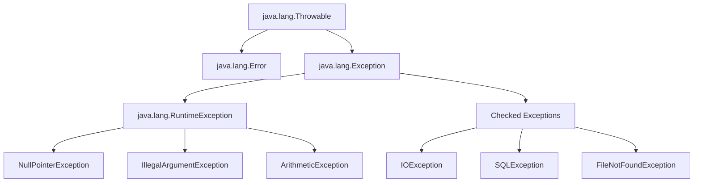

# Unchecked vs Checked Exceptions

Com certeza, Gedê\! Vamos detalhar sobre Unchecked vs Checked Exceptions em Java, um tópico fundamental para escrever um código robusto e profissional, algo que você já faz como desenvolvedor Backend Java e que será importante na sua transição para Go.

---

## Unchecked vs Checked Exceptions em Java

### 1\. Introdução

No desenvolvimento de software, lidar com erros e situações inesperadas é tão crucial quanto implementar a lógica de negócio. Em Java, o mecanismo para gerenciar essas ocorrências é o tratamento de exceções. As exceções permitem que um programa reaja de forma controlada a problemas que surgem durante sua execução, como a falta de um arquivo, uma conexão de rede interrompida, ou a tentativa de dividir um número por zero.

Compreender a distinção entre "Checked Exceptions" e "Unchecked Exceptions" é vital para escrever código Java eficiente, seguro e de fácil manutenção. Essa diferenciação afeta diretamente a forma como você estrutura seu código, a robustez das suas aplicações e a experiência do usuário. Ignorar essa distinção pode levar a bugs difíceis de depurar ou a códigos verbosos e ineficazes. Para você, Gedê, que já trabalha com backend, saber exatamente como e quando usar cada tipo de exceção é um diferencial para construir sistemas mais resilientes.

### 2\. Sumário

Esta explicação abordará os seguintes tópicos:

- Definição e Conceitos Fundamentais
    - O que são Exceções?
    - Checked Exceptions
    - Unchecked Exceptions (Runtime Exceptions)
- Sintaxe e Estrutura do Tratamento de Exceções
- Componentes Principais
    - `try`
    - `catch`
    - `finally`
    - `throw`
    - `throws`
- Restrições de Uso e Melhores Práticas
- Exemplos de Código Otimizados
    - Checked Exception em Ação
    - Unchecked Exception em Ação
    - Exceção Personalizada (Checked)
    - Exceção Personalizada (Unchecked)
    - `try-with-resources`
- Informações Adicionais
    - Hierarquia das Exceções
    - `Error` vs `Exception`
    - Quando Lançar e Quando Capturar
    - Evitando a Captura Genérica de Exceções
- Referências para Estudo Independente

### 3\. Conteúdo Detalhado

### Definição e Conceitos Fundamentais

**O que são Exceções?**

Uma exceção é um evento que interrompe o fluxo normal de um programa. Quando uma exceção ocorre, um objeto de exceção é criado e "lançado" (thrown). Se essa exceção não for "capturada" (caught) e tratada, o programa será encerrado abruptamente. Exceções em Java são objetos que herdam da classe `java.lang.Throwable`.

Existem dois tipos principais de exceções em Java:

**Checked Exceptions (Exceções Verificadas)**

- **Definição:** São exceções que o compilador Java "verifica" em tempo de compilação. Isso significa que, se um método pode lançar uma checked exception, ele **deve** declará-la usando a cláusula `throws` em sua assinatura, ou o código que chama esse método **deve** capturá-la usando um bloco `try-catch`. Se você não fizer uma dessas ações, o código não compilará.
- **Para que servem:** Geralmente representam condições anormais, mas recuperáveis, que estão fora do controle direto do programador e que podem acontecer em operações externas (como I/O, rede, acesso a banco de dados). O compilador obriga o desenvolvedor a pensar em como lidar com essas situações, promovendo um código mais robusto.
- **Exemplos Comuns:** `IOException`, `SQLException`, `FileNotFoundException`, `ClassNotFoundException`.

**Unchecked Exceptions (Exceções Não Verificadas / Runtime Exceptions)**

- **Definição:** São exceções que o compilador Java **não** verifica em tempo de compilação. Elas herdam de `java.lang.RuntimeException` (ou `java.lang.Error`, embora `Error` não seja tipicamente tratada pelo programa). Você não é obrigado a declará-las com `throws` nem a capturá-las.
- **Para que servem:** Representam geralmente falhas na lógica de programação, erros de uso da API ou condições que, se ocorrerem, indicam um bug no código e, portanto, não são esperadas de serem recuperáveis pelo fluxo normal do programa. A ideia é que o programador deve corrigir o erro, não tratá-lo no fluxo normal.
- **Exemplos Comuns:** `NullPointerException`, `ArrayIndexOutOfBoundsException`, `IllegalArgumentException`, `ArithmeticException`, `ConcurrentModificationException`.

### Sintaxe e Estrutura do Tratamento de Exceções

O tratamento de exceções em Java é realizado principalmente através dos blocos `try`, `catch` e `finally`, além das palavras-chave `throw` e `throws`.

```java
public class ExemploExcecoes {

    public void metodoQuePodeLancarChecked() throws IOException {
        // Código que pode lançar uma Checked Exception
        // Exemplo: new FileReader("arquivo_inexistente.txt");
    }

    public void metodoQuePodeLancarUnchecked() {
        // Código que pode lançar uma Unchecked Exception
        // Exemplo: int resultado = 10 / 0;
    }

    public void usarMetodos() {
        try {
            metodoQuePodeLancarChecked(); // Chamar um método que declara uma Checked Exception
            metodoQuePodeLancarUnchecked(); // Chamar um método que pode lançar uma Unchecked Exception
        } catch (IOException e) { // Captura da Checked Exception
            System.err.println("Erro de I/O: " + e.getMessage());
        } catch (ArithmeticException e) { // Captura específica de uma Unchecked Exception
            System.err.println("Erro aritmético: " + e.getMessage());
        } catch (RuntimeException e) { // Captura genérica de outras Unchecked Exceptions
            System.err.println("Erro em tempo de execução: " + e.getMessage());
        } catch (Exception e) { // Captura genérica de qualquer outra Exception (boa prática para final de catch)
            System.err.println("Ocorreu uma exceção inesperada: " + e.getMessage());
        } finally {
            System.out.println("Este bloco sempre será executado, independentemente de exceções.");
        }
    }
}

```

### Componentes Principais

- **`try`:**
    - **Função:** Delimita um bloco de código onde exceções podem ocorrer. O código dentro do `try` é monitorado para a ocorrência de exceções.
    - **Estrutura:** Sempre seguido por um ou mais blocos `catch` ou um bloco `finally` (ou ambos).
- **`catch`:**
    - **Função:** Captura e trata uma exceção específica que foi lançada no bloco `try` associado. Você pode ter múltiplos blocos `catch` para tratar diferentes tipos de exceções.
    - **Estrutura:** `catch (TipoDaExcecao nomeVariavel) { ... }`. A ordem dos blocos `catch` importa: exceções mais específicas devem vir antes das mais genéricas.
- **`finally`:**
    - **Função:** Contém código que sempre será executado, independentemente de uma exceção ter ocorrido ou não, ou de ter sido capturada. É útil para liberar recursos (fechar arquivos, conexões de banco de dados).
    - **Estrutura:** Opcional, mas se presente, é o último bloco associado a um `try`.
- **`throw`:**
    - **Função:** Usada para lançar uma instância de exceção explicitamente.
    - **Estrutura:** `throw new AlgumaExcecao("Mensagem de erro");`
- **`throws`:**
    - **Função:** Usada na assinatura de um método para declarar que ele pode lançar uma ou mais *checked exceptions*. Isso informa ao compilador e aos chamadores do método que eles precisam lidar com essas exceções.
    - **Estrutura:** `public void meuMetodo() throws IOException, SQLException { ... }`

### Restrições de Uso e Melhores Práticas

- **Checked Exceptions:**
    - Devem ser usadas para situações onde o chamador *pode* e *deve* ter uma estratégia para recuperar-se ou pelo menos ser notificado do problema (ex: arquivo não encontrado).
    - Evite transformá-las em Unchecked Exceptions a menos que haja um motivo muito forte (ex: uma exceção de I/O dentro de um método de utilidade que não pode ser facilmente tratada pelo chamador e indica um problema de configuração global).
    - Não as ignore. Isso compromete a robustez do sistema.
- **Unchecked Exceptions:**
    - Devem ser usadas para indicar erros de programação (`NullPointerException`, `IllegalArgumentException`). A expectativa é que o programador corrija o bug, não que o sistema se recupere em tempo de execução.
    - Evite capturar `RuntimeException` de forma genérica, a menos que você tenha uma estratégia clara de tratamento (ex: um global handler em uma API REST que converte exceções em mensagens de erro HTTP). Capturar `RuntimeException` indiscriminadamente pode mascarar bugs reais.
- **Geral:**
    - **Seja específico nos `catch`:** Capture apenas as exceções que você sabe como tratar.
    - **Não "engula" exceções:** Evite blocos `catch` vazios ou que apenas imprimem a stack trace sem tomar uma ação. Isso pode esconder problemas críticos.
    - **Use `finally` para limpeza de recursos:** Garanta que recursos como streams e conexões sejam fechados. Com Java 7+, use `try-with-resources`.
    - **Crie exceções personalizadas:** Quando as exceções existentes não descrevem adequadamente a condição de erro do seu domínio. Se a condição for recuperável, que seja `checked`; se for um bug, que seja `unchecked`.
    - **Logging:** Sempre registre as exceções de forma adequada. Isso ajuda na depuração em ambientes de produção.

### 4\. Exemplos de Código Otimizados

### Checked Exception em Ação

Um cenário comum para `Checked Exceptions` é a leitura/escrita de arquivos. O compilador força você a lidar com a possibilidade de o arquivo não existir ou haver problemas de permissão.

```java
import java.io.BufferedReader;
import java.io.FileReader;
import java.io.IOException;

public class ArquivoUtils {

    /**
     * Tenta ler a primeira linha de um arquivo.
     * Lança IOException se ocorrer algum problema de I/O.
     *
     * @param caminhoArquivo O caminho completo do arquivo.
     * @return A primeira linha do arquivo, ou null se o arquivo estiver vazio.
     * @throws IOException Se ocorrer um erro de leitura ou o arquivo não for encontrado.
     */
    public String lerPrimeiraLinha(String caminhoArquivo) throws IOException {
        // O try-with-resources garante que o BufferedReader seja fechado automaticamente
        try (BufferedReader reader = new BufferedReader(new FileReader(caminhoArquivo))) {
            return reader.readLine();
        }
        // Não é necessário um bloco catch aqui, pois a exceção é declarada com throws
    }

    public static void main(String[] args) {
        ArquivoUtils utils = new ArquivoUtils();
        String arquivoValido = "src/main/resources/config.properties"; // Suponha que exista
        String arquivoInvalido = "arquivo_nao_existe.txt";

        // Exemplo de tratamento para arquivo válido
        try {
            String primeiraLinha = utils.lerPrimeiraLinha(arquivoValido);
            System.out.println("Primeira linha do arquivo '" + arquivoValido + "': " + primeiraLinha);
        } catch (IOException e) {
            System.err.println("ERRO ao ler o arquivo '" + arquivoValido + "': " + e.getMessage());
            // Logar a exceção completa para depuração
            e.printStackTrace();
        }

        System.out.println("\\n--- Tentando ler arquivo inexistente ---");

        // Exemplo de tratamento para arquivo inexistente
        try {
            String primeiraLinha = utils.lerPrimeiraLinha(arquivoInvalido);
            System.out.println("Primeira linha do arquivo '" + arquivoInvalido + "': " + primeiraLinha);
        } catch (IOException e) {
            System.err.println("ERRO ao ler o arquivo '" + arquivoInvalido + "': " + e.getMessage());
            System.err.println("Causa provável: Arquivo não encontrado ou erro de permissão.");
            // Logar a exceção completa
            e.printStackTrace();
        }
    }
}

```

**Para o exemplo acima funcionar, crie um arquivo `config.properties` na pasta `src/main/resources/` com algum conteúdo.**

### Unchecked Exception em Ação

Um exemplo clássico de `Unchecked Exception` é a `NullPointerException` ou `IllegalArgumentException`, que geralmente indicam um problema na lógica ou nos parâmetros passados.

```java
public class Calculadora {

    /**
     * Divide dois números. Lança uma IllegalArgumentException se o divisor for zero.
     * Esta é uma Unchecked Exception, pois dividir por zero é um erro de lógica de negócio
     * que deve ser evitado pelo chamador.
     *
     * @param numerador O número a ser dividido.
     * @param divisor   O número pelo qual dividir.
     * @return O resultado da divisão.
     * @throws IllegalArgumentException Se o divisor for zero.
     */
    public double dividir(double numerador, double divisor) {
        if (divisor == 0) {
            throw new IllegalArgumentException("Divisor não pode ser zero.");
        }
        return numerador / divisor;
    }

    public static void main(String[] args) {
        Calculadora calc = new Calculadora();

        // Cenário de sucesso
        double resultado1 = calc.dividir(10, 2);
        System.out.println("10 / 2 = " + resultado1);

        // Cenário de falha (Unchecked Exception)
        try {
            double resultado2 = calc.dividir(10, 0); // Isso vai lançar uma IllegalArgumentException
            System.out.println("10 / 0 = " + resultado2); // Esta linha nunca será executada
        } catch (IllegalArgumentException e) {
            System.err.println("Erro de validação: " + e.getMessage());
            // Para Unchecked Exceptions, geralmente não tratamos, mas logamos e deixamos o programa falhar ou um handler global intervir.
            // Aqui, é um exemplo simples de captura para mostrar o comportamento.
            e.printStackTrace();
        }

        // Outra Unchecked Exception: NullPointerException
        String nome = null;
        try {
            System.out.println("Tamanho do nome: " + nome.length()); // Lançará NullPointerException
        } catch (NullPointerException e) {
            System.err.println("Erro: Variável 'nome' está nula. " + e.getMessage());
            e.printStackTrace();
        }
    }
}

```

### Exceção Personalizada (Checked)

Útil para representar condições de erro específicas da sua aplicação que o chamador deve ser obrigado a tratar.

```java
// 1. Definição da Checked Exception Personalizada
class SaldoInsuficienteException extends Exception {
    private double saldoAtual;
    private double valorSaque;

    public SaldoInsuficienteException(String message, double saldoAtual, double valorSaque) {
        super(message);
        this.saldoAtual = saldoAtual;
        this.valorSaque = valorSaque;
    }

    public double getSaldoAtual() {
        return saldoAtual;
    }

    public double getValorSaque() {
        return valorSaque;
    }
}

// 2. Classe que utiliza a exceção
class ContaBancaria {
    private double saldo;

    public ContaBancaria(double saldoInicial) {
        this.saldo = saldoInicial;
    }

    /**
     * Tenta sacar um valor da conta. Lança SaldoInsuficienteException se o saldo for menor que o valor do saque.
     * Como é uma Checked Exception, o método DEVE declará-la com 'throws'.
     *
     * @param valor O valor a ser sacado.
     * @throws SaldoInsuficienteException Se o saldo for insuficiente.
     */
    public void sacar(double valor) throws SaldoInsuficienteException {
        if (valor > saldo) {
            throw new SaldoInsuficienteException("Saldo insuficiente para realizar o saque.", saldo, valor);
        }
        this.saldo -= valor;
        System.out.println("Saque de R$" + valor + " realizado com sucesso. Saldo atual: R$" + saldo);
    }

    public double getSaldo() {
        return saldo;
    }
}

// 3. Exemplo de uso e tratamento da exceção
public class ExemploCheckedCustomizada {
    public static void main(String[] args) {
        ContaBancaria minhaConta = new ContaBancaria(500.0);

        try {
            minhaConta.sacar(200.0); // Saque bem-sucedido
            minhaConta.sacar(400.0); // Isso lançará a exceção
        } catch (SaldoInsuficienteException e) {
            System.err.println("Erro de saque: " + e.getMessage());
            System.err.println("Detalhes: Saldo Atual = R$" + e.getSaldoAtual() + ", Valor Saque = R$" + e.getValorSaque());
            // Ações de recuperação: notificar o usuário, registrar o evento, etc.
        } catch (Exception e) { // Captura genérica para outras exceções inesperadas
            System.err.println("Um erro inesperado ocorreu: " + e.getMessage());
        }
    }
}

```

### Exceção Personalizada (Unchecked)

Útil para indicar um erro de lógica de programação ou um estado inválido que não deve ser recuperado em tempo de execução, mas sim corrigido no código.

```java
// 1. Definição da Unchecked Exception Personalizada
class ConfiguracaoInvalidaException extends RuntimeException {
    public ConfiguracaoInvalidaException(String message) {
        super(message);
    }

    public ConfiguracaoInvalidaException(String message, Throwable cause) {
        super(message, cause);
    }
}

// 2. Classe que utiliza a exceção
class ConfiguradorAplicacao {
    private String databaseUrl;
    private int maxConnections;

    public ConfiguradorAplicacao(String dbUrl, int maxConn) {
        if (dbUrl == null || dbUrl.trim().isEmpty()) {
            throw new ConfiguracaoInvalidaException("A URL do banco de dados não pode ser nula ou vazia.");
        }
        if (maxConn <= 0) {
            throw new ConfiguracaoInvalidaException("O número máximo de conexões deve ser positivo.");
        }
        this.databaseUrl = dbUrl;
        this.maxConnections = maxConn;
    }

    public void inicializar() {
        System.out.println("Inicializando aplicação com:");
        System.out.println("  Database URL: " + databaseUrl);
        System.out.println("  Max Connections: " + maxConnections);
    }
}

// 3. Exemplo de uso da exceção
public class ExemploUncheckedCustomizada {
    public static void main(String[] args) {
        // Cenário de sucesso
        System.out.println("--- Tentando configurar com valores válidos ---");
        ConfiguradorAplicacao config1 = new ConfiguradorAplicacao("jdbc:mysql://localhost/db", 10);
        config1.inicializar();

        System.out.println("\\n--- Tentando configurar com valores inválidos ---");
        // Cenário de falha: URL nula (lança ConfiguracaoInvalidaException)
        try {
            ConfiguradorAplicacao config2 = new ConfiguradorAplicacao(null, 5);
            config2.inicializar(); // Esta linha nunca será executada
        } catch (ConfiguracaoInvalidaException e) {
            System.err.println("Erro de configuração (Unchecked): " + e.getMessage());
            // Geralmente, para unchecked, o tratamento seria em um nível mais alto (global handler)
            // ou o programa falharia para indicar um bug no código.
            e.printStackTrace();
        }

        System.out.println("\\n--- Tentando configurar com conexões inválidas ---");
        // Cenário de falha: Conexões <= 0 (lança ConfiguracaoInvalidaException)
        try {
            ConfiguradorAplicacao config3 = new ConfiguradorAplicacao("jdbc:postgresql://localhost/db", 0);
            config3.inicializar(); // Esta linha nunca será executada
        } catch (ConfiguracaoInvalidaException e) {
            System.err.println("Erro de configuração (Unchecked): " + e.getMessage());
            e.printStackTrace();
        }
    }
}

```

### `try-with-resources`

Introduzido no Java 7, o `try-with-resources` é uma construção poderosa para gerenciar recursos que implementam a interface `java.lang.AutoCloseable`. Ele garante que o recurso seja fechado automaticamente ao final do bloco `try`, mesmo que uma exceção ocorra. Isso elimina a necessidade de um bloco `finally` explícito para fechamento de recursos e ajuda a evitar vazamentos de recursos.

```java
import java.io.BufferedReader;
import java.io.FileReader;
import java.io.IOException;

public class TryWithResourcesExample {

    public static void lerArquivoComTryWithResources(String caminhoArquivo) {
        // O recurso (BufferedReader) é declarado dentro dos parênteses do try.
        // Ele será automaticamente fechado no final do bloco try,
        // mesmo que ocorra uma exceção.
        try (BufferedReader reader = new BufferedReader(new FileReader(caminhoArquivo))) {
            String line;
            System.out.println("Lendo o arquivo: " + caminhoArquivo);
            while ((line = reader.readLine()) != null) {
                System.out.println("Linha: " + line);
            }
        } catch (IOException e) {
            System.err.println("Ocorreu um erro de I/O ao ler o arquivo: " + e.getMessage());
            e.printStackTrace();
        }
    }

    public static void main(String[] args) {
        String arquivoExistente = "src/main/resources/exemplo.txt"; // Certifique-se de que este arquivo exista
        String arquivoInexistente = "src/main/resources/nao_existe.txt";

        // Para este exemplo funcionar, crie um arquivo "exemplo.txt" dentro de "src/main/resources/"
        // com algum texto dentro.
        lerArquivoComTryWithResources(arquivoExistente);

        System.out.println("\\n--- Tentando ler um arquivo inexistente ---");
        lerArquivoComTryWithResources(arquivoInexistente);
    }
}

```

**Para o exemplo acima funcionar, crie um arquivo `exemplo.txt` na pasta `src/main/resources/` com algum conteúdo.**

### 5\. Informações Adicionais

### Hierarquia das Exceções

Todas as classes de exceção em Java são subclasses de `java.lang.Throwable`.

- `Throwable`
    - `Error`: Indica problemas sérios e irrecuperáveis que a aplicação não deve tentar tratar (ex: `OutOfMemoryError`, `StackOverflowError`).
    - `Exception`: Superclasse de todas as exceções que um programa pode e deve tentar tratar.
        - `RuntimeException` (Unchecked): Subclasse de `Exception`. Inclui exceções que geralmente indicam erros de programação (ex: `NullPointerException`, `ArrayIndexOutOfBoundsException`).
        - Outras `Exception` (Checked): Exceções que o compilador exige tratamento (ex: `IOException`, `SQLException`).

<!-- end list -->



### `Error` vs `Exception`

Como mencionado, `Error` representa problemas fora do controle do aplicativo que não devem ser capturados e tratados, pois geralmente indicam falhas na JVM ou no ambiente. `Exception` representa condições que o aplicativo pode e deve lidar.

### Quando Lançar e Quando Capturar

- **Lançar (`throw`):**
    - Quando um método detecta uma condição de erro que ele não pode ou não deve resolver internamente.
    - Para informar ao chamador que algo deu errado e que a responsabilidade de lidar com isso é do chamador.
    - Se a condição é um erro de lógica de programação, lance uma `Unchecked Exception`.
    - Se a condição é uma falha externa que o chamador pode potencialmente se recuperar, lance uma `Checked Exception`.
- **Capturar (`catch`):**
    - Quando você pode fornecer uma ação de recuperação significativa para a exceção (ex: tentar novamente a operação, usar um valor padrão, notificar o usuário).
    - Em pontos de controle onde você quer que o programa continue a execução, mas com alguma ressalva ou alteração de fluxo.
    - Em camadas de interface (REST controllers, UI) para traduzir exceções técnicas em mensagens amigáveis ao usuário.

### Evitando a Captura Genérica de Exceções (`catch (Exception e)`)

Embora seja tentador usar `catch (Exception e)` para pegar qualquer tipo de problema, isso geralmente é uma má prática. Ele captura tanto checked quanto unchecked exceptions, mascarando bugs reais e dificultando a depuração. Use-o com extrema cautela e apenas quando você realmente precisa de um "catch-all" em um nível muito alto da sua aplicação (como um global exception handler em um framework web), onde você vai registrar o erro e talvez retornar uma mensagem genérica.

Para você, Gedê, que já trabalha com backend, usar um `@ControllerAdvice` no Spring para um tratamento global de exceções é um exemplo de um lugar onde um `catch (Exception e)` pode ser aceitável, desde que você registre o erro e retorne um `status 500` com uma mensagem apropriada.

### 6\. Referências para Estudo Independente

- **Documentação Oficial da Oracle:**
    - [The Catch or Specify Requirement (Oracle Java Tutorials)](https://www.google.com/search?q=https://docs.oracle.com/javase/tutorial/essential/exceptions/catchOrSpecify.html) - Explica a diferença entre Checked e Unchecked Exceptions.
    - [The `trycatch` Blocks (Oracle Java Tutorials)](https://www.google.com/search?q=%5Bhttps://docs.oracle.com/javase/tutorial/essential/exceptions/try.html%5D%5C(https://docs.oracle.com/javase/tutorial/essential/exceptions/try.html%5C))
    - [The `finally` Block (Oracle Java Tutorials)](https://www.google.com/search?q=%5Bhttps://docs.oracle.com/javase/tutorial/essential/exceptions/finally.html%5D%5C(https://docs.oracle.com/javase/tutorial/essential/exceptions/finally.html%5C))
    - [Specifying the Exceptions Thrown by a Method (`throws`)](https://www.google.com/search?q=%5Bhttps://docs.oracle.com/javase/tutorial/essential/exceptions/declaring.html%5D%5C(https://docs.oracle.com/javase/tutorial/essential/exceptions/declaring.html%5C))
    - [How to Create Custom Exception Classes](https://docs.oracle.com/javase/tutorial/essential/exceptions/creating.html)
    - [The `try`with-resources Statement](https://www.google.com/search?q=%5Bhttps://docs.oracle.com/javase/tutorial/essential/exceptions/tryResource.html%5D%5C(https://docs.oracle.com/javase/tutorial/essential/exceptions/tryResource.html%5C))
- **Artigos e Livros:**
    - **"Effective Java" por Joshua Bloch:** O Item 71 ("Favor checked exceptions for recoverable conditions and unchecked exceptions for programming errors") e o Item 72 ("Prefer standard exceptions to custom exceptions") são altamente relevantes.
    - **"Clean Code" por Robert C. Martin:** Discute princípios de como lidar com erros e exceções de forma limpa e eficaz.
    - [Baeldung: Guide to Java Exceptions](https://www.baeldung.com/java-exceptions) - Um guia abrangente e prático.

---